  # Quiz_App_JAVA

• Developed a quiz application featuring an intuitive user interface and a comprehensive question database.. 
• Developed a robust admin panel for efficient management and customization of quiz content.

## Getting Started

## 📷 Previews

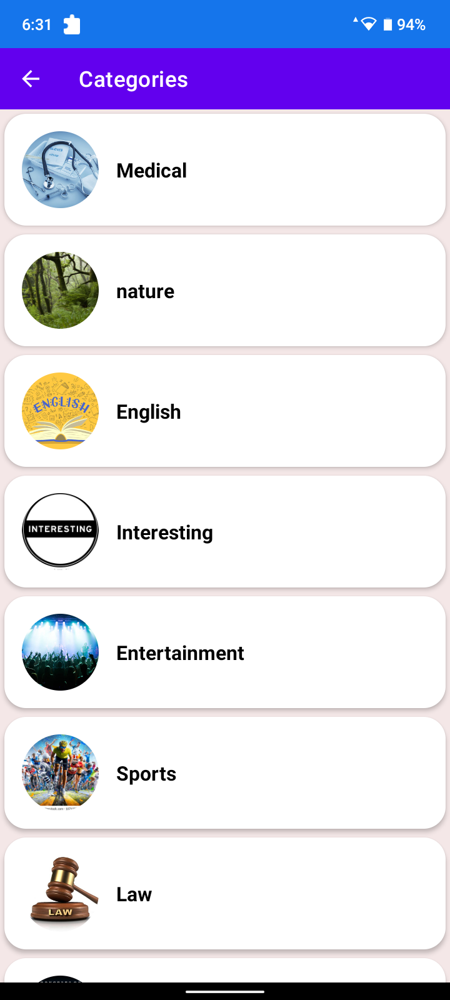
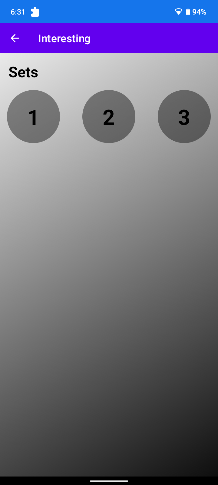
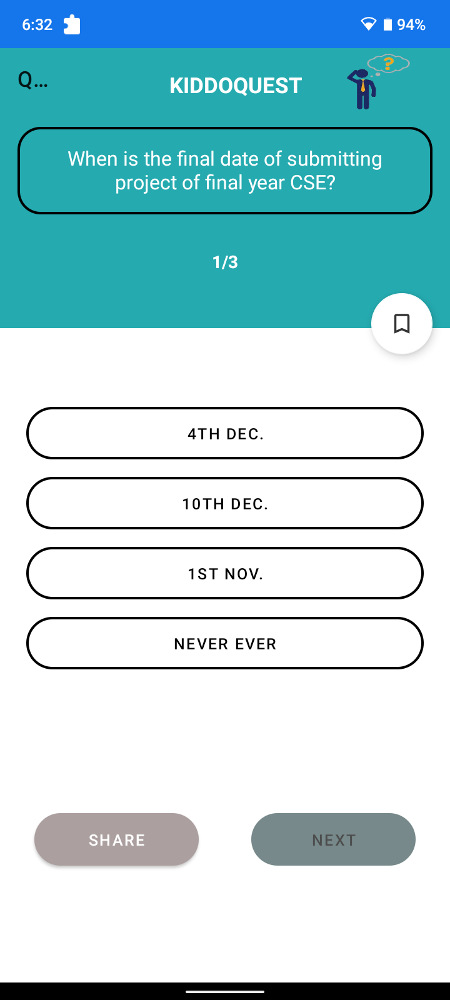
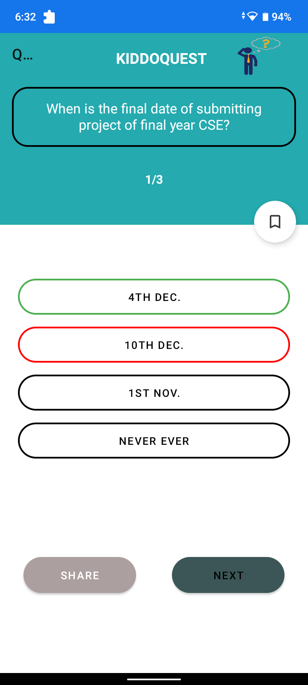

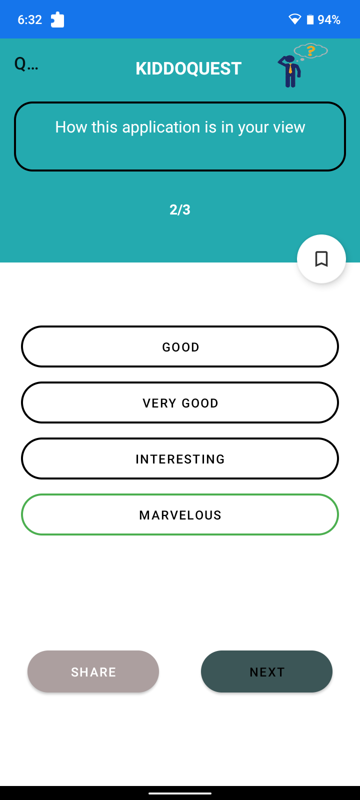
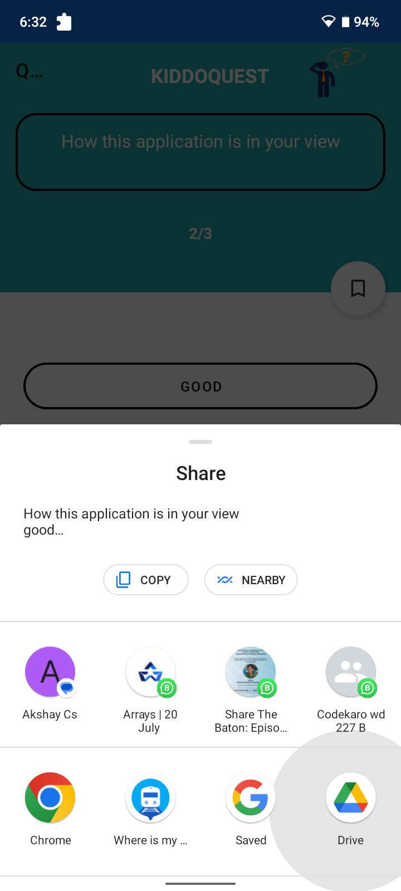
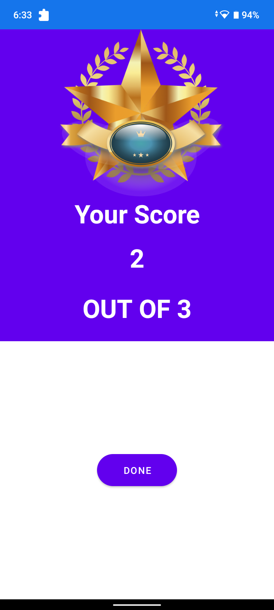

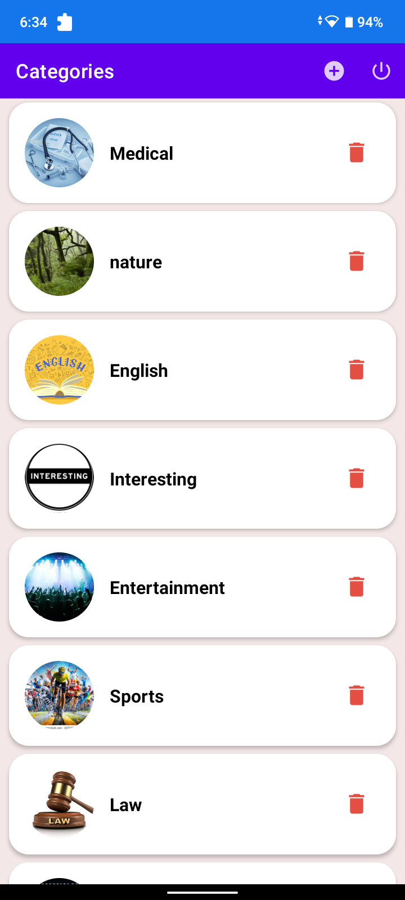
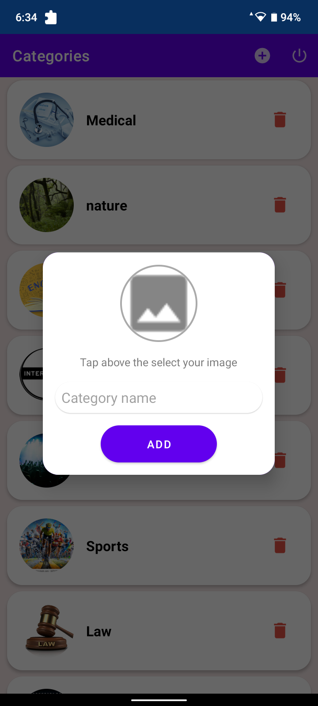

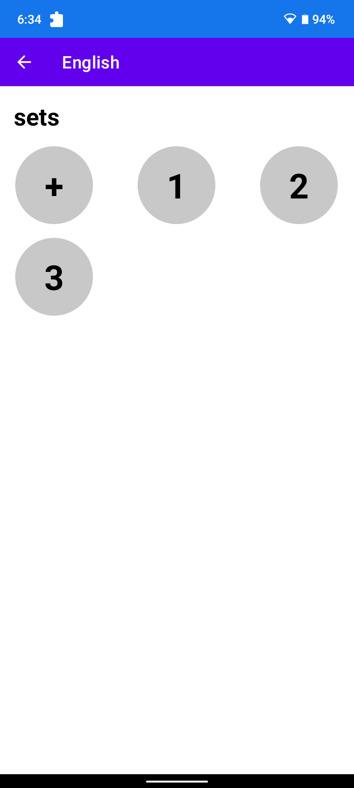
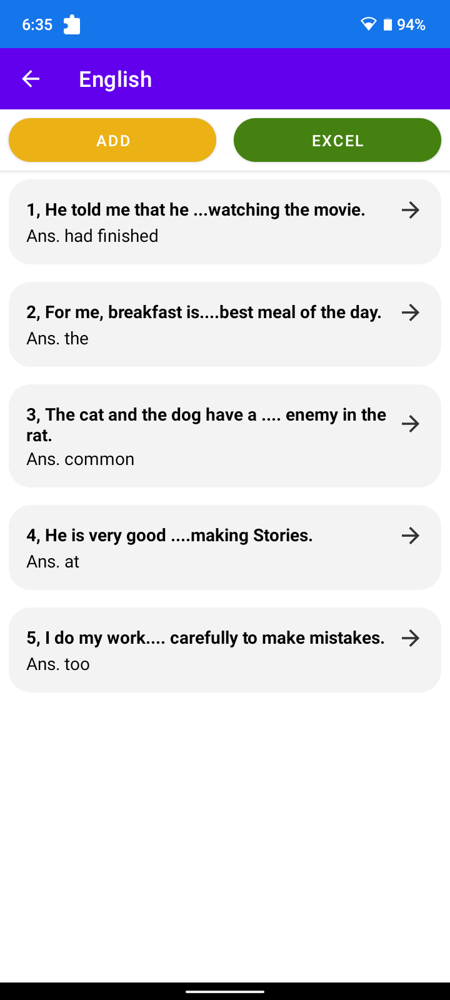
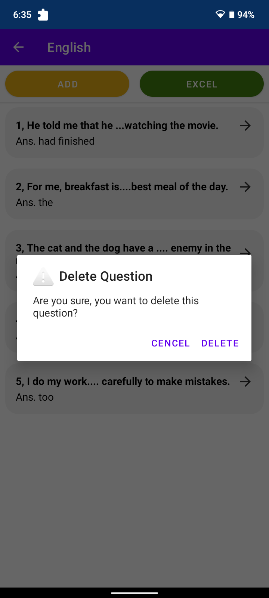

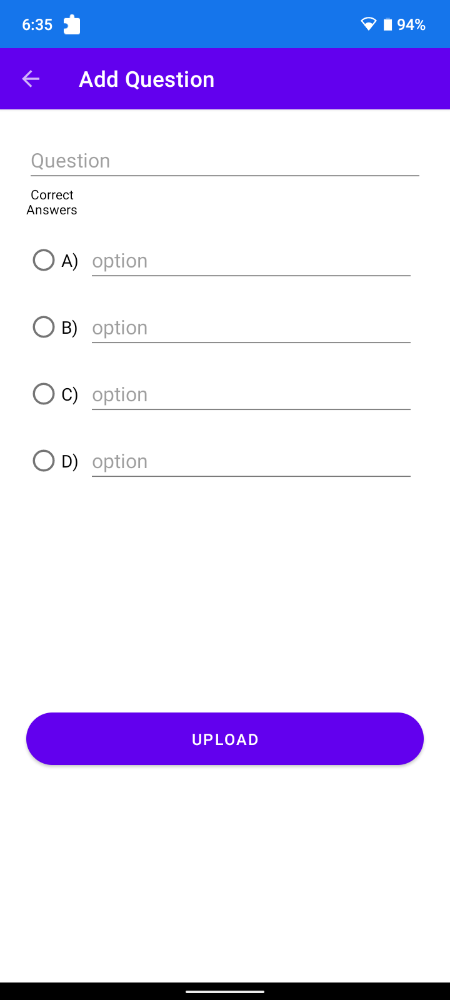

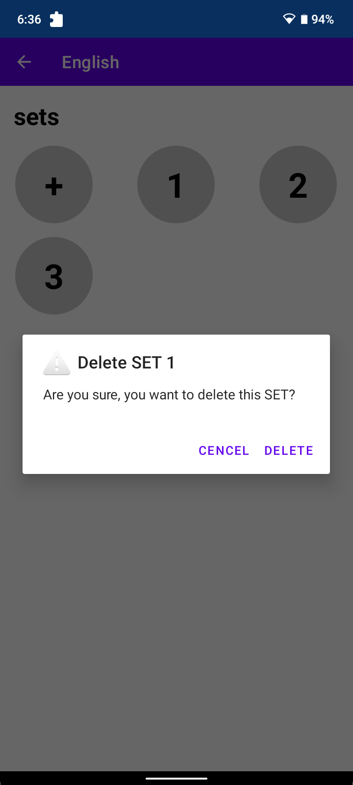
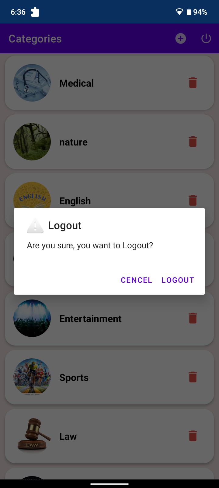

